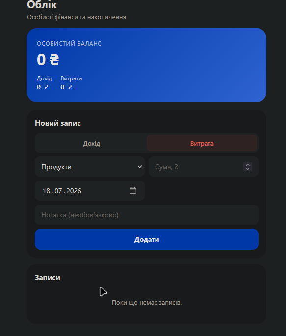

# Tg-Excel-BOT

🇺🇦 [Українською](#українською) · 🇬🇧 [In English](#in-english)

  

---

## Українською

Telegram Mini App для обліку особистих фінансів — [@ToloGarExcelbot](https://t.me/ToloGarExcelbot).

Роблю чисто для себе і для приколу, зроблено поки що халтурно, але далі буде краще. Трохи довайбкодено 🙂

### Плани на майбутнє
- Бекенд на Python (нагадування, автоматичні курси валют, аналітика по місяцях)
- Швидкий запис витрат текстом прямо в чат боту
- Експорт в Excel

---

## In English

Telegram Mini App for personal finance tracking — [@ToloGarExcelbot](https://t.me/ToloGarExcelbot).

Built purely for fun and personal use. Currently a bit rough around the edges, will get better over time. Partially vibe-coded 🙂

### Roadmap
- Python backend (reminders, automatic exchange rates, monthly analytics)
- Quick expense logging by typing directly into the bot chat
- Excel export

---

## License
MIT
